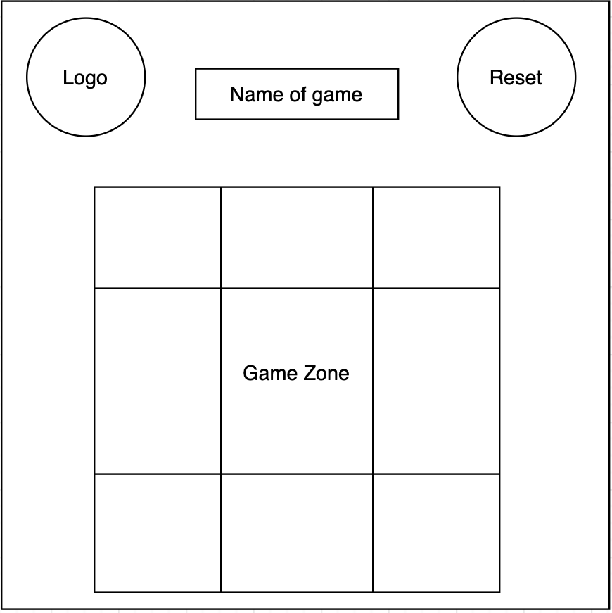

# Tic-Tac-Toe

## Project Tic Tac Toe:

* A game for two players, X and O, who take turns marking the spaces in a 3×3 grid. The player who succeeds in placing three of their marks in a horizontal, vertical, or diagonal row is the winner.

## Game Link :
https://amirahalmani.github.io/Tic-Tac-Toe/

## List technologies used to build tic tac toe I used

* html

* css

* Javascript

## User Story :

* User can hear tone when click and when win or tie.
* Game will show messageg who is win X or O.
* Game will reset automatic when X is win or O win or tie without refreshing the page.
* User can reset game any time without refreshing the page.
* User can play in different device.

## Wireframes:

## Development process and problem-solving strategy:

* Build html and css files.
* Create JS file.
* Create variables.
* Create function click and save clicks.
* Create array to win condition
* Create function to compare users cliks and win condition
and aleart who is win.
* Create the function to reset game.

##  Winner function:

* I use for loop to check user clicks and compare it with win conditions array then aleart winner and reset game.
If no one win aleart tie.

## favorite functions:

* Winner function , compare between user cliks and condition win array then alert winner or tie.
